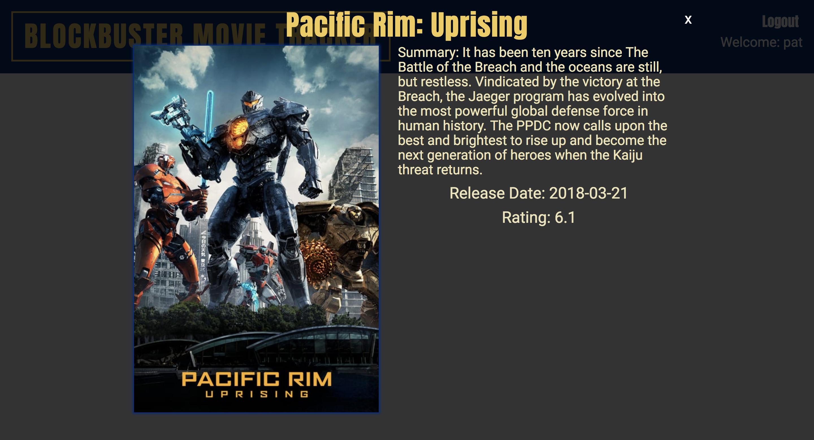

# Movie Tracker

An application used to present new movie releases, and allows a user to add a movie to their favorites. App is built on the front end using React, React-Router, Redux, and CSS. The app uses a postgresql backend. Testing suite was build using Jest/Enzyme. Project was build over the course of 9 days with a 3-person team.

## Team

  *[Ngoc Phan](https://github.com/nphan24)
  *[Pat McLaughlin](https://github.com/patrickmc21)
  *[Ricardo Viera](https://github.com/rvwatch)

## Project Status

This project is currently through the extensions of the project specification. Users can sign in by entering their name and password on the landing page. They can view all new releases, or click a button to view their favorites. They can favorite movie cards that will persist until their next visit. Users can select an individual movie to view more information about that movie. 

## Project Screen Shots

## Installation and Setup Instructions

Clone down this repository. You will need `node` and `npm` installed globally on your machine.  

Installation:

`npm install`  

To Run Test Suite:  

`npm test`  

To Start Server:

`npm start`  

To Visit App:

`localhost:3000`

You will need a key from [The Movie DB API](https://www.themoviedb.org/documentation/api) stored in `src/ApiCalls` in a file named `apiKey.js`. Key needs to be set to a `const apiKey` and exported using `export default`

To install server:

You will need `node` and `Homebrew`

clone down [this repo](https://github.com/turingschool-examples/movie-tracker)

`npm install`

`brew install postgresql`

`npm run build`

`npm start`

## Reflection

This was a two week group project during Module Three of the front end program at Turing. Project goals included implementing Redux into a React app along with React-Router, as well as fetching new movie release information from the Movie DB API. Additionally, we were to use jest/enzyme to build a thorough testing suite to help guide us during app development.

We set out to build an app that would allow a user to view new movie releases and be able to add a movie to favorites. Clicking the `view more` button on each movie would reveal additional information about the selected movie. Users can view their favorites in one location after visiting the favorites page. Users are able to login using their email and password using the postgres server so that their favorited movies will be stored. 

One of the main challenges was implementing the postgres backend. This was our first dive into handling our own backend. Additionally, this was our first dive into using React-Redux in an app, so getting our store set up was a new and challenging process. 

Technologies used to to implement this project were the Movie DB API, React, React-Router, React-Redux, postgreSQL, JSX, vanillaJS, and CSS, as well as Jest/Enzyme for the testing suite. The boilerplate repo used to build this app was constructed using `create-react-app`.